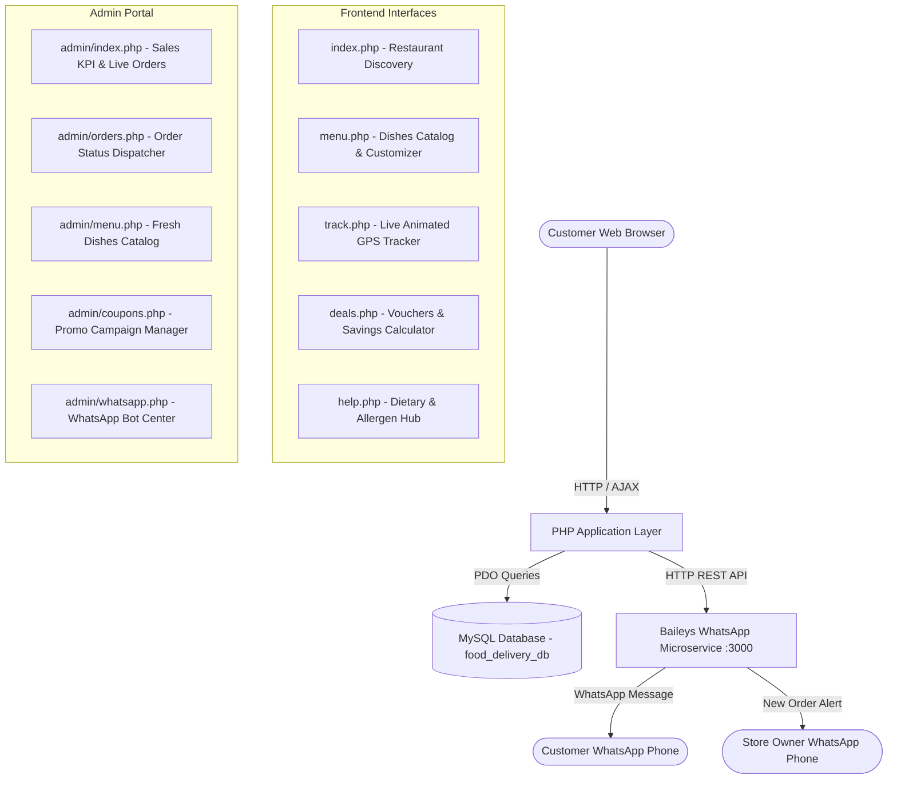

# 🐼 FoodHub Express — Modern Online Food Delivery & WhatsApp Automation Platform

<p align="center">
  
</p>

<p align="center">
  <strong>A full-stack, responsive, Foodpanda-inspired Food Delivery platform with an interactive customer storefront, live GPS order tracking, owner kitchen admin portal, and automated WhatsApp bot notifications.</strong>
</p>

<p align="center">
  
  
  
  
  
  
</p>

---

## 📖 Overview

**FoodHub Express** is an enterprise-grade food delivery web application designed to offer customers a frictionless, modern ordering journey and give kitchen owners full real-time operational control. 

Built cleanly without bloated dependencies, the app combines **Foodpanda's signature pink design aesthetic** (`#ff2b85`), an interactive **Dish Customization Modal**, **Live HTML5 Canvas Delivery Motorbike Tracking**, an **Admin Control Panel**, and automated **WhatsApp Notifications** powered by a Baileys Multi-Device engine.

---

## ✨ Key Feature Highlights

### 🛍️ Customer Experience & Resources
- 🍔 **Multi-Restaurant & Cuisine Discovery**: Browse gourmet burgers, artisan pizza, Japanese ramen, fresh salads, Mexican tacos, and bubble tea with instant category pills and autocomplete search.
- 🍲 **Interactive Dish Customizer**: Choose bun styles, crusts, extra toppings, spice levels (🔥 to 🔥🔥🔥), and write custom cooking instructions with real-time price calculations.
- 🏷️ **Working Voucher & Deals Hub (`deals.php`)**: Copyable promo codes (`WELCOME50`, `FREEDEL`, `BURGER20`, `FEAST10`) with an interactive savings calculator.
- 🛵 **Live GPS Motorcycle Order Tracker (`track.php`)**: 5-stage progress timeline (Placed ➔ Confirmed ➔ Cooking ➔ On The Way ➔ Delivered) with an **animated HTML5 Canvas city map** showing the motorcycle rider moving smoothly along the route.
- 💡 **Dietary & Allergen Guide (`help.php`)**: Verified information for Halal-certified kitchens, Vegan/Vegetarian dishes, and Gluten-free meals.
- 💬 **24/7 Interactive AI Support Assistant**: Floating customer service chatbot for instant FAQ answers and refund policies.

---

### 👑 Owner & Kitchen Admin Panel (`/admin`)
- 📊 **Real-time Operations Dashboard**: Live KPI metrics (Total Sales Revenue, Active Kitchen Orders, Total Orders Processed, and Total Menu Items).
- 📋 **Order Dispatcher & Status Manager (`admin/orders.php`)**: View live order feeds, filter by status, inspect item receipts, and advance status with **1-click live synchronization to customer GPS screens and WhatsApp**.
- 🍔 **Fresh Dish & Menu Catalog (`admin/menu.php`)**: Upload fresh dishes with photos, prices, calories, prep times, dietary flags, and customization add-on options.
- 🏷️ **Promo Campaign Creator (`admin/coupons.php`)**: Create percentage or fixed discount codes with minimum order limits.
- 💬 **WhatsApp Bot Control Center (`admin/whatsapp.php`)**: Monitor live WhatsApp connection status (`+923216793596` Connected 🟢), send live test alerts, and scan QR codes.

---

### 📱 WhatsApp Automation Engine
- 📥 **Automated Customer Order Receipts**: Sends formatted WhatsApp confirmations with order numbers, items breakdown, pricing, and a clickable live GPS tracking link.
- 🔔 **Instant Store Owner Alerts**: Alerts the restaurant owner on WhatsApp whenever a new customer order is placed.
- 🍳 **Cooking & Rider On-The-Way Alerts**: Real-time status notifications sent directly to the customer's phone as their order progresses.
- 🛵 **Direct WhatsApp Chat with Rider & Kitchen**: Quick 1-click WhatsApp chat triggers on tracking and restaurant pages.

---

## 🏗️ System Architecture



---

## 📁 Directory Structure

```text
food-delivery/
├── admin/                  # Owner & Kitchen Management Portal
│   ├── api.php             # Admin AJAX backend (status updates, dishes, coupons)
│   ├── coupons.php         # Discount vouchers manager
│   ├── footer.php          # Admin footer & modal scripts
│   ├── header.php          # Admin sidebar navigation & topbar
│   ├── index.php           # Operations dashboard & KPI overview
│   ├── menu.php            # Fresh dish catalog & option builder
│   ├── orders.php          # Customer orders status dispatcher
│   └── whatsapp.php        # WhatsApp Bot control center & test tool
├── api/                    # Public RESTful API Endpoints
│   ├── coupons.php         # Voucher validation & discounts
│   ├── menu.php            # Grouped dishes & customization options
│   ├── orders.php          # Order creation, tracking & status updates
│   ├── restaurants.php     # Restaurant discovery & multi-filters
│   ├── reviews.php         # Customer ratings & reviews submission
│   └── support.php         # Knowledge base & AI chatbot queries
├── assets/                 # Client-side Static Assets
│   ├── css/
│   │   └── style.css       # Foodpanda-inspired modern responsive design system
│   └── js/
│       ├── app.js          # Autocomplete search, category filters & toasts
│       ├── cart.js         # Reactive slide-over cart drawer & checkout
│       ├── modal.js        # Dish customizer & live price calculator
│       ├── support.js      # Floating AI chatbot widget
│       └── tracker.js      # HTML5 Canvas animated motorcycle delivery route
├── data/                   # Database & Integration Layer
│   ├── config.php          # MySQL & WhatsApp configuration settings
│   ├── db.php              # MySQL PDO auto-migrator & rich sample data seeder
│   └── whatsapp.php        # Baileys WhatsApp microservice client
├── includes/               # Reusable Customer View Components
│   ├── cart_drawer.php     # Slide-over cart drawer & checkout modal
│   ├── dish_modal.php      # Dish customization popup
│   ├── footer.php          # Footer links & script loader
│   ├── header.php          # Sticky navigation, search & location picker
│   └── support_modal.php   # Address picker & chatbot widget
├── database.sql            # Standalone SQL database schema & seed data
├── deals.php               # Customer deals & voucher hub
├── help.php                # Customer help & dietary center
├── index.php               # Customer storefront & restaurant discovery
├── menu.php                # Complete food & dishes showcase catalog
├── restaurant.php          # Restaurant profile & interactive menu
├── track.php               # Live GPS order tracking screen
├── .gitignore              # Git ignored files
└── README.md               # Project documentation
```

---

## 🚀 Quick Start Guide

### 1. Prerequisites
- **PHP** >= 8.2 (with `pdo_mysql`, `curl`, `json`, `mbstring` enabled)
- **MySQL / MariaDB** (e.g. via XAMPP, WAMP, or standalone service)
- **Node.js** >= 18.x (for the optional Baileys WhatsApp microservice in `auto-whatsapp`)

---

### 2. Database Configuration
Open `data/config.php` and verify your MySQL credentials:

```php
define('DB_HOST', '127.0.0.1');
define('DB_PORT', '3306');
define('DB_NAME', 'food_delivery_db');
define('DB_USER', 'root');
define('DB_PASS', '');

// WhatsApp Bot Settings
define('WHATSAPP_API_URL', 'http://127.0.0.1:3000');
define('WHATSAPP_ADMIN_PHONE', '923216793596');
```

> [!NOTE]
> `data/db.php` automatically creates the database `food_delivery_db` and pre-seeds 6 diverse restaurants, 40+ dishes, customization add-ons, and promo vouchers on first run! You can also import `database.sql` directly into phpMyAdmin if desired.

---

### 3. Launch the Application

In your project root directory:

```bash
php -S localhost:8000
```

Now open your web browser:

| Portal | URL |
| :--- | :--- |
| **🏠 Customer Storefront** | [http://localhost:8000](http://localhost:8000) |
| **🍔 Dishes & Menu Catalog** | [http://localhost:8000/menu.php](http://localhost:8000/menu.php) |
| **🛵 Live Order GPS Tracker** | [http://localhost:8000/track.php](http://localhost:8000/track.php) |
| **🏷️ Deals & Promo Hub** | [http://localhost:8000/deals.php](http://localhost:8000/deals.php) |
| **👑 Owner & Kitchen Admin** | [http://localhost:8000/admin](http://localhost:8000/admin) |
| **💬 WhatsApp Bot Hub** | [http://localhost:8000/admin/whatsapp.php](http://localhost:8000/admin/whatsapp.php) |

---

## 📡 RESTful API Reference

| Method | Endpoint | Description |
| :--- | :--- | :--- |
| `GET` | `/api/restaurants.php` | List restaurants with search, cuisine, rating & dietary filters |
| `GET` | `/api/menu.php?restaurant_id=1` | Get restaurant menu items, add-on options, and reviews |
| `POST` | `/api/coupons.php` | Validate coupon code against subtotal and calculate discount |
| `POST` | `/api/orders.php` | Place order and trigger automated WhatsApp notifications |
| `GET` | `/api/orders.php?order_number=...` | Retrieve full order details and live preparation status |
| `POST` | `/api/reviews.php` | Submit customer review & update restaurant rating average |
| `GET` | `/api/support.php?query=...` | Instant FAQ knowledge base and AI chatbot answers |

---

## 🤝 Contributing
1. Fork the repository
2. Create a feature branch (`git checkout -b feature/NewFeature`)
3. Commit your changes (`git commit -m 'Add NewFeature'`)
4. Push to the branch (`git push origin feature/NewFeature`)
5. Open a Pull Request

---

## 📄 License
This project is open-source and available under the [MIT License](LICENSE).
